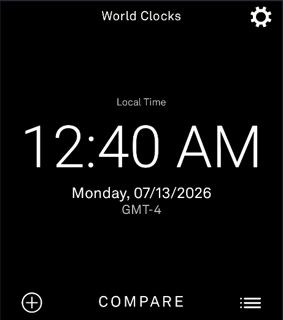
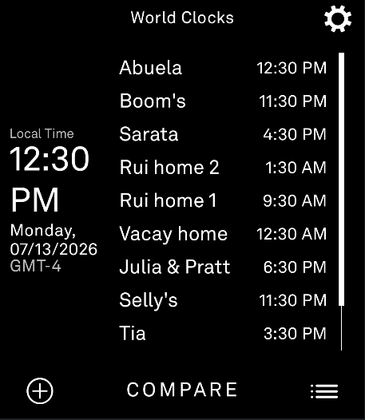
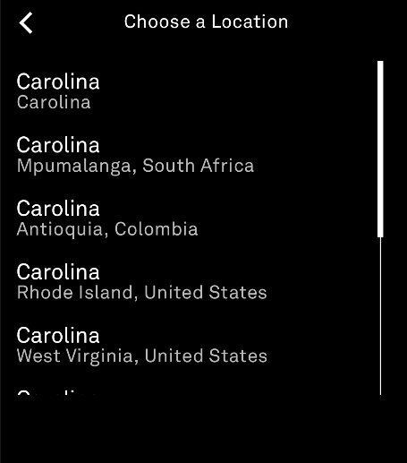
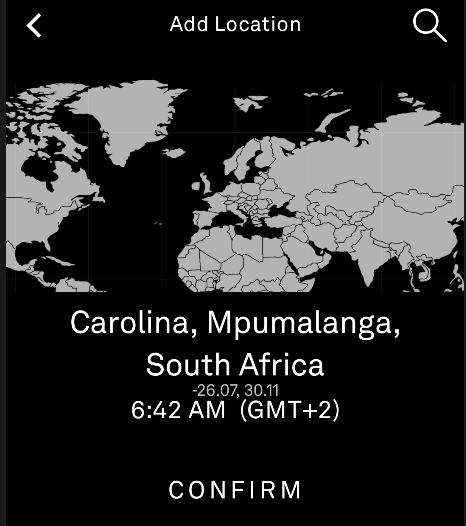
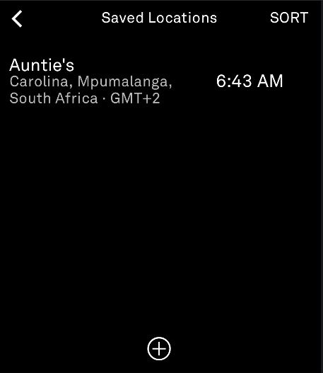
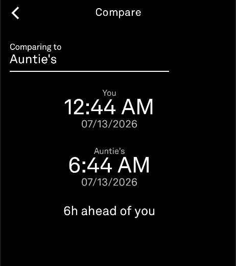
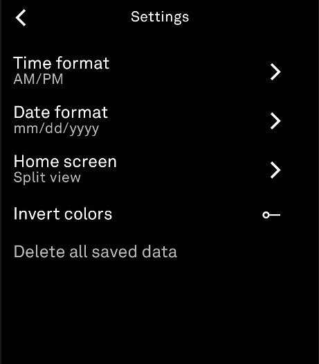

# World Clocks

A little tool for the Light Phone III that keeps track of what time it is for the people you care about, wherever they happen to be.

Type in a friend's, a family member's, a coworker's, whoever's location, save it, and look at your Compare screen to see their local time right next to yours. It's handy for checking if it's actually a decent hour to call someone before you dial.

## What it does

* Shows your local time on the home screen, using whatever time zone your phone is already set to. No setup needed.
* Lets you search for a place and save it under your own label, like "Mom" or "Tokyo Office."
* Shows all your saved locations in a list with their current local time, so you can check on everyone at a glance.
* Has a Compare screen that puts your time next to a saved location's time and tells you the difference in hours, like "6h ahead of you."
* Has a Split view option for the home screen too, local time on the left, all your saved locations and their times on the right, so you can check everyone without leaving Home.
* Lets you set the time format (AM/PM or 24 hour), pick a date format, invert the colors, and wipe all your saved data if you want to start clean.

## How to use it

* Tap the plus icon on the home screen to add a new location.
* Type in a place name and search. If more than one place matches (there is, in fact, more than one "Carolina" out there), you'll get a list to pick the right one from.
* Confirm the place, give it a label, and it's saved.
* Tap the list icon on the home screen to see everything you've saved. Tap any location to rename or delete it. Tap SORT to reorder your list however you like.
* Tap COMPARE to check your time against any saved location.
* Tap the gear icon for settings, time format, date format, colors, and clearing your data.

## Screenshots

<p>
  
  
  
</p>
<p>
  
  
  
</p>
<p>
  
</p>

## Idea credit

Thanks to terminatia on discord for the idea for this tool. They were envisioning a tool that could help them easily keep track of the local time that their loved ones live in, and thus World Clocks was created.

## Built with Light SDK

This tool is built using the Light Phone's own SDK for building tools that run on the Light Phone III. All the credit for the actual device, the design language, and the underlying framework goes to Light. This repo is just a tool built on top of it, not a fork or a replacement for anything Light makes.

## Map artwork credit

The world map used throughout the app is based on a black and white world map illustration. Full credit and thanks to the original creator, found here: <a href="https://www.freevector.com/black-and-white-world-map-90984">FreeVector.com</a>

## Building it yourself

If you've got the Light SDK set up already, this is just another tool module. Point Gradle at it and build like normal, something like:

```
.\gradlew.bat :worldclocks:installDebug
```

Package name is `com.tyshi00.worldclocks`, tool label is "World Clocks."
