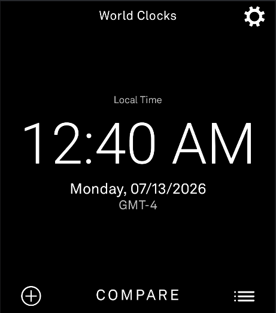
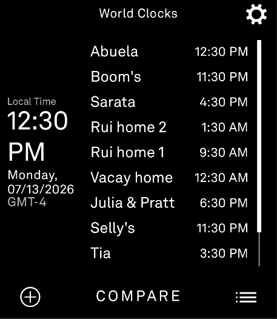
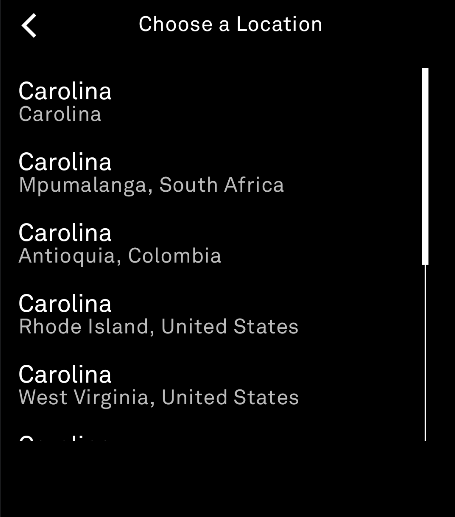
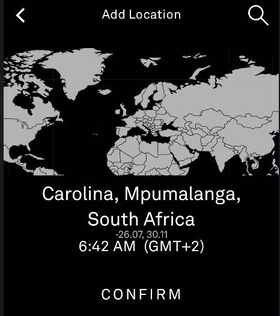
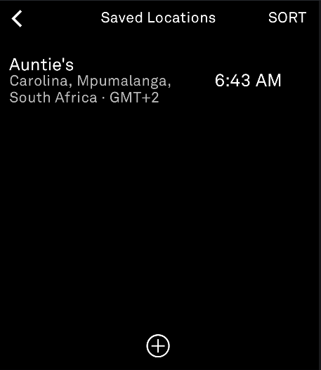
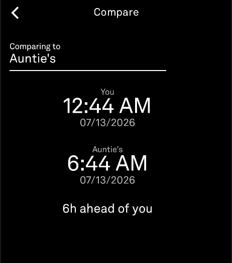
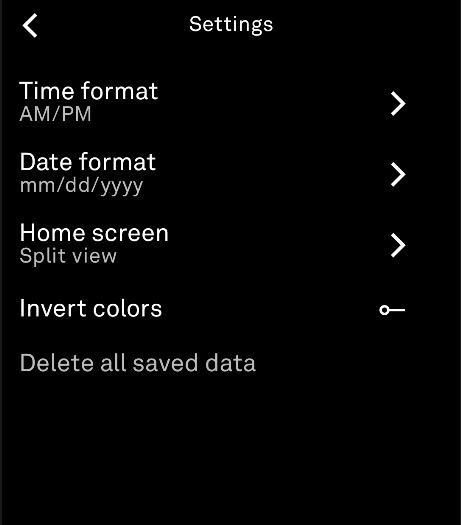

# World Clocks

A tool for the Light Phone III that shows the local time for the people you care about, wherever they are. Save a friend's or family member's location and compare their time with yours before you call.

## Features

* Shows your local time on the home screen, using your phone's time zone. No setup needed.
* Search for a place and save it under your own label, like "Mom" or "Tokyo Office."
* Lists all saved locations with their current local time.
* Compare screen puts your time next to a saved location's time and shows the difference, like "6h ahead of you."
* Split view for the home screen: local time on the left, all saved locations and their times on the right.
* Settings for time format (AM/PM or 24-hour), date format, inverted colors, and clearing all saved data.

## Screenshots

<p>
  
  
  
</p>
<p>
  
  
  
</p>
<p>
  
</p>

## Usage

* Tap the plus icon on the home screen to add a new location.
* Type a place name and search. If more than one place matches (there is more than one "Carolina"), pick the right one from the list.
* Confirm the place, give it a label, and it's saved.
* Tap the list icon on the home screen to see your saved locations. Tap any location to rename or delete it. Tap SORT to reorder the list.
* Tap COMPARE to check your time against any saved location.
* Tap the gear icon for settings: time format, date format, colors, and clearing your data.

## Installation

### From Releases

Download `worldclocks-release-candidate.apk` from the [latest release](https://github.com/tyshi00/World-Clocks/releases/tag/latest) and install it over ADB:

```
adb install worldclocks-release-candidate.apk
```

A new build is published to this release on every push to `main`.

### From Source

The Light SDK libraries are hosted on GitHub Packages, so you need a GitHub token with the `read:packages` scope. Add your credentials to `local.properties` in the project root:

```
gpr.user=YOUR_GITHUB_USERNAME
gpr.key=YOUR_GITHUB_TOKEN
```

Then build and install to a connected Light Phone III:

```
# Windows
.\gradlew.bat :worldclocks:installDebug

# macOS / Linux
./gradlew :worldclocks:installDebug
```

Package name: `com.tyshi00.worldclocks`. Tool label: "World Clocks."

## Credits

Built on the [Light SDK](https://github.com/lightphone/light-sdk) by The Light Phone (MIT). The original copyright notice is kept in [LICENSE](LICENSE), and the SDK's own README is kept in [README.light-sdk.md](README.light-sdk.md). All credit for the device, the design language, and the underlying framework goes to Light.

Idea by terminatia on Discord, who wanted an easy way to keep track of the local time where their loved ones live.

World map artwork based on a black and white world map illustration from [FreeVector.com](https://www.freevector.com/black-and-white-world-map-90984).

## License

MIT. See [LICENSE](LICENSE).

## Disclaimer

Unofficial, independent open-source project — not affiliated with or endorsed by The Light Phone, Inc. Light Phone and Light OS are trademarks of The Light Phone, Inc.
